# Hi there! I'm Akash 

<div align="center">
  
### 🚀 Aspiring Full-Stack Developer | Game Dev Enthusiast | Problem Solver

[](https://git.io/typing-svg)

</div>

---

## 🎯 About Me!

```cpp
class Developer {
private:
    string name = "Akash";
    string status = "IT Student";
    vector<string> currentFocus = {"C++", "DSA", "Full-Stack Development"};
    
public:
    void getCurrentlyLearning() {
        cout << "🎮 Unreal Engine with C++" << endl;
        cout << "🌐 Full-Stack Web Development" << endl;
        cout << "🧠 Advanced Data Structures & Algorithms" << endl;
    }
    
    string getGoal() {
        return "Become a versatile developer across web, game dev, and AI! 🚀";
    }
};
```

<div align="center">

### 💫 What Drives Me

</div>

🎓 **IT Student** passionate about turning ideas into reality through code  
💡 **Problem Solver** who loves tackling complex coding challenges  
🎮 **Game Dev Explorer** combining creativity with technical skills  
🌱 **Lifelong Learner** always pushing boundaries and exploring new technologies  
✨ **Innovation Seeker** interested in AI, software engineering, and creative tech

---

## 🛠️ Tech Arsenal

<div align="center">

### 🔥 Languages & Technologies


### 🌐 Web Development


### 🎮 Game Development


### 🔧 Tools & Platforms


</div>

---

## 📊 GitHub Analytics

<div align="center">
  


</div>

<div align="center">
  
[](https://git.io/streak-stats)

</div>

---

## 🎯 Current Learning Journey

```mermaid
graph TD
    A[🎓 IT Student] --> B[💻 C++ Mastery]
    A --> C[🧠 DSA Expertise]
    A --> D[🌐 Full-Stack Web Dev]
    B --> E[🎮 Unreal Engine + C++]
    C --> F[🏆 Coding Challenges]
    D --> G[🚀 Real-world Applications]
    E --> H[🎯 Versatile Developer]
    F --> H
    G --> H
```

<div align="center">



</div>

### 🔍 Focus Areas

- **Data Structures & Algorithms:** Building strong problem-solving foundations
- **Full-Stack Development:** Creating end-to-end web applications
- **Game Development:** Exploring interactive entertainment with Unreal Engine
- **Open Source:** Contributing to collaborative projects and learning from the community

---

## 🏆 Achievements & Highlights

<div align="center">

### 🌟 Coding Journey Milestones

</div>

- 🎯 **Problem Solver:** Actively solving coding challenges to sharpen algorithmic thinking
- 🎮 **Game Dev Explorer:** Learning Unreal Engine to merge creativity with programming
- 🌐 **Web Dev Enthusiast:** Building responsive and user-friendly web applications
- 📚 **Continuous Learner:** Always exploring new technologies and frameworks

---

## 🚀 Future Goals

<div align="center">

### 🎯 Roadmap to Success

</div>

- **Short-term (2024-2025):**
  - Master C++ and advanced DSA concepts
  - Complete first full-stack web application
  - Develop and publish first game using Unreal Engine
  
- **Long-term Vision:**
  - Become a versatile developer working across multiple domains
  - Contribute to innovative AI and tech projects
  - Mentor other aspiring developers

---

## 📈 Activity Graph

<div align="center">

[](https://github.com/AkashV-V/github-readme-activity-graph)

</div>

---

## 🎵 Currently Vibing To


---

## 💬 Let's Connect & Collaborate!

<div align="center">

### 🌟 Always open to interesting conversations and collaborations!

[](https://linkedin.com/in/YOUR_USERNAME)
[](https://github.com/YOUR_USERNAME)
[](mailto:your.email@example.com)

</div>

---

<div align="center">

### 💡 Fun Fact

*"Code is like humor. When you have to explain it, it's bad."* – Cory House

**Let's build something amazing together! 🚀**


</div>

---

<div align="center">
  
### ⭐ If you find my work interesting, consider giving it a star!

</div>
